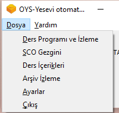
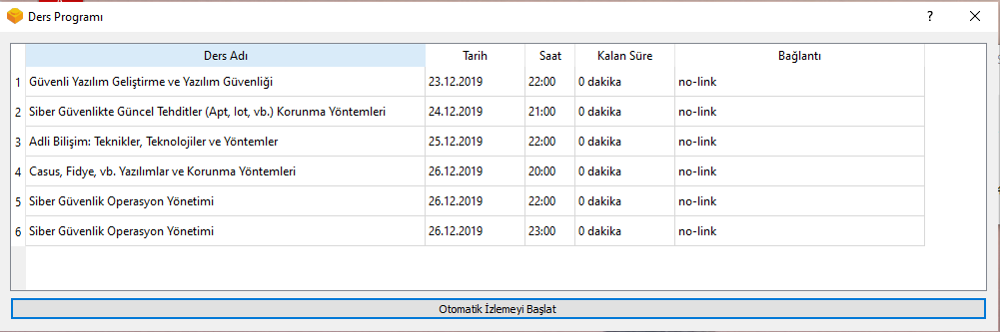
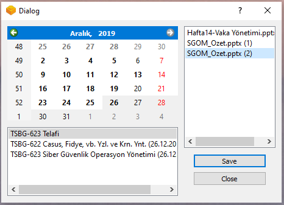
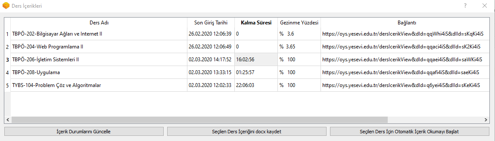
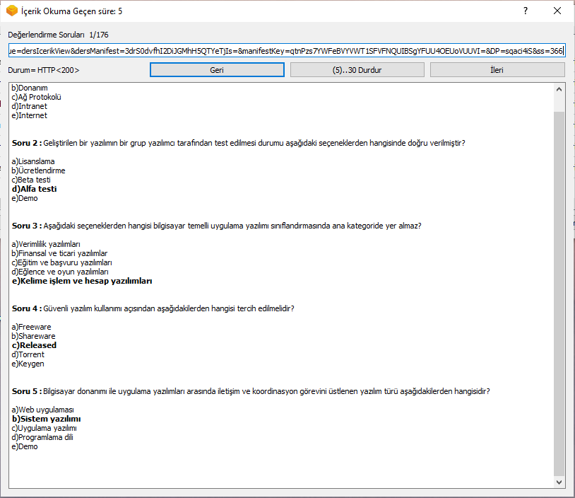
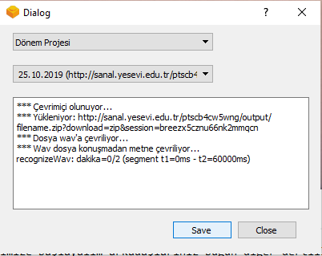
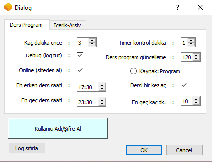
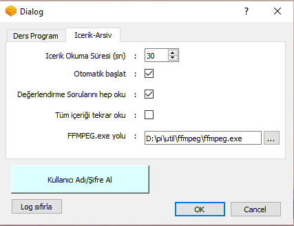

 
# yesevi-oys
Yesevi oys sisteminde dersleri saati geldiğinde otomatik başlatma uygulaması
 

  
Ders saati geldiğinde, özellikle de o güne yeni ders eklenmişse, derse girmeyi unutabilirsiniz.
Bu program ders saatinde tarayıcı sayfasını otomatik açar.
Eve gittiğinizde bilgisayarınızı açın, programı çalıştırın. Otomatik izlemeyi başlat deyin. Bilgisayarın sesini açın.

Ders başladığınız hocanızın "iyi akşamlar arkadaşlar" sesiyle, dersin başladığını anlayıp, derse katılabilirsiniz.
 ============================================================================= 

  
ScoGezgini menüsünden: 
  - Derslere ait sunumları indirebilirsiniz.
  - Takvimden ders günü seçtiğinizde alt kutuya o günkü dersler listelenir.
  - Alt kutudan dersi seçtiğinizde o derse ait indirilebilecek dosyalar sağ kutuya listelenir.
  - Sağ kutuda dosya seçip Save butonuna bastığınızda dosya sistemde indirilebilir halde mevcut ise indirilir.
  - Dosya aynı ad ile ulaşılamıyorsa, derse ait içerik (swf slide oynatıcı ile beraber) zip olarak indirilir.
  - Not: dosyalar bazen sco ile belirtilen yolda değil, diğer yolda olabiliyor. Sistemin admin tarafında işleyişini bilmediğimden tahminimce
  - pdf'den ppt'ye, pptx'e vs çevrimler sonunda bir kaç dosya sco'su oluşuyor.
  - Bunlardan birinin url'sinde diğerinin dosya adını indirebiliyorsunuz. Bu mantığı programla kurmak istemedim.
  - Bunun yerine dosya adlarının yanın sco-depth'lerini yazdım. Derinlik 2 olan daha kuvvetle muhtemel inecektir.
  - İlle de o dosyayı manuel indirmek isterseniz buradaki açıklamaları takip edin:
  - https://tarikozcan.wordpress.com/2017/07/14/turtepte-sanal-derste-gosterilen-sunulari-indirmek/
 =========================================================================== 

  
Ders İçerikleri menüsünden:
  - Ders içerikleri okuma durumunuzu görebilirsiniz.
  - Ders içeriklerini docx olarak kaydedebilirsiniz.
  - Bilgiler ilk okumada veritabanına kayıt edilir. 
  - Güncel durum için 'İçerik Durumlarını Güncelle' butonunu kullanabilirsiniz.
  - Tablodan bir ders seçip sağ alttaki ...Başlat butonuna basın.
  - Yeni bir pencere açılacak ve 10 saniye içinde otomatik okuma başlayacaktır.
  - İsterseniz Başlat'a basıp hemen başlatabilirsiniz.
  - Sistemde okuma süreleri değişik bir algorita ile dönmektedir. İlk sayfalarda 3 saniye, 4 saniye vs gibi
  süreler varken, sonrakilerde son tarihten sonra geçen süre hesaplanmıştır. Bu algoritmayı çözmekle uğraşmak 
  yerine;
  - Her ders için minimum okuma süresi olan ders tespit edilir. Bu süreden en fazla 10 saniye daha fazla okunmuş
  olanlar yeniden okuma listesine alınır. Bu 10 saniyeyi ayarlardan artırabilirsiniz.
  - Her sayfa 10 saniye süre ile açılır. Bitine işlem durur ve tablo güncellenir.
  - Tüm sayfaların okumaları bittikten sonra Ayarlar'dan "Değerlendirme sorularını hep oku" ayarını işaretleyip 
  sadece soruları getirebilirsiniz. Böylece dersi gözden geçirmiş olursunuz.  
 =========================================================================== 

  
Arşiv İzleme menüsünden:
  - Ders listesinden dersi seçin
  - Alttaki arşiv listesinden ders tarihini seçin
  - Save butonuna basınca, ilgili arşiv video kaydının metne çevrilmiş dosyası (tape'si) oluşturulacak ve notepad ile açılacaktır.
 =========================================================================== 

  
**Ayarlar** açıklaması: 
- Kaç dakika önce     : ders sayfası, ders saatinden kaç dakika önce açılsın. def=3
- Debug (log tut)     : bir dosyaya (ve/veya konsola) debug bilgileri yazılsın def=hayır
- Online (siteden al) : uygulama online mı çalışsın, yoksa indirdiği responselar üzerinden offline mı def:evet
- En erken, En geç ders saati      : bu saatler dışında ders programı güncellemesi yapma, ders açma def:17.30-23.30
- Timer kontrol dakika: otomatik işlemler kaç dakikada bir çalışsın (program kontrol) def=1
- Ders program güncelleme          : ders programını siteden ne periyodda güncellesin def=120
- Kaynak              : Liste (ders listesinden oku) Program (ders programından oku)
- Dersi bir kez aç    : otomatik açılan sayfada problem olması halinde dakikada bir sayfayı tekrar aç def=açma
- En geç kaç dk.      : dersi birden fazla açacaksa, ders saatinden en geç kaç dk. sonra tekrar açsın (timer kontrol dakika'da belirtilen dk.da bir açılacak) def=10
  

  
- Icerik okuma süresi : Otomatik ders içeriği okuma işleminde, her sayfa kaç saniye okunacak...
- Otomatik başlat     : Icerik okuma penceresi açıldıktan sonra 10 sn içinde okumayı başlat, bitince kapat
- Değerlendirme Sorularını hep oku : Minimum süre okunmuş olsa dahi Değerlendirme sorularını tekrar oku
- Tüm içeriği tekrar oku           : Minimum süre okunmuş olsa dahi tüm sayfaları tekrar oku
- FFMPEG.exe yolu     : ffmpeg kütüphanesini yükleyin ve exe yolunu burada gösterin.
 =========================================================================== 
Python içinden kullanabilmek için ilgili modülleri kurmalısınız. (pip install ...)
exe'ye çevirmek için fbs modülünü indirip, aynı klasör yapısını oluşturun. Scriptlerden sanal ortamı activate.bat ile aktifleştirin.
"fbs freeze" ile exe'ye çevirebilirsiniz.

Veya <a href=https://1drv.ms/u/s!AnY5SpLroMRqlZQDVdwOXJoE7Oy0DQ> kurulum paketi</a> ile windowsa kurup kullanabilirsiniz. (windows 10 ve 2012'da denendi)

NOT: Bu açık kaynak bir projedir. Sitede zaman içinde meydana gelen değişiklikler nedeniyle çalışmayan ekranlar olursa, kendiniz değiştirip düzeltebilirsiniz. Benim öğrenciliğim bittiği için sisteme erişemiyorum, zaman ayıramaıyorum, dolayısı ile düzeltme yapmam söz konusu değil. Lütfen kodu çekip öğreniniz.
